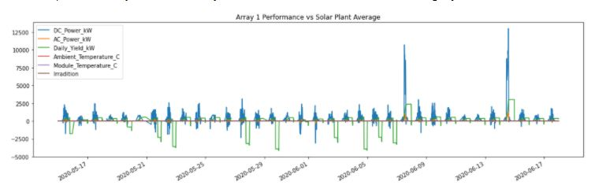
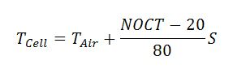
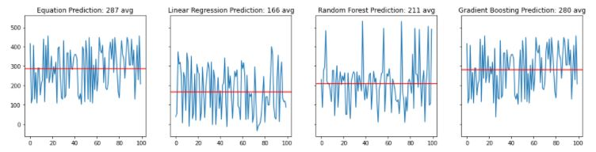
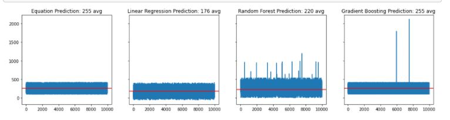
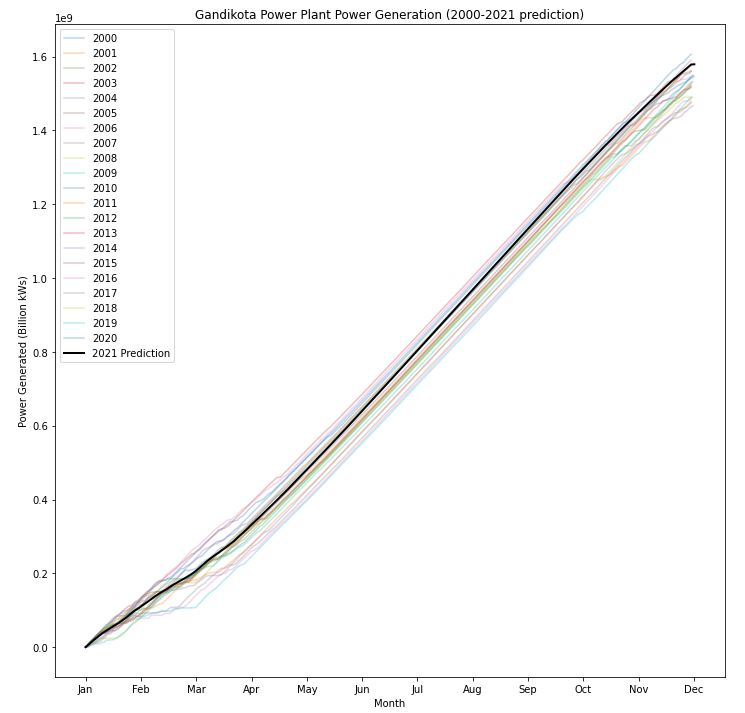
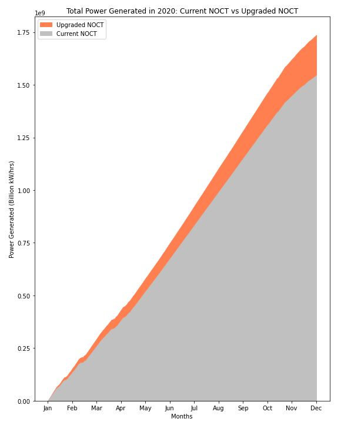

# ☀️ Solar Power Prediction Model ⚡️
## Data Science Project
- For code go to [Notebooks](/sppm.ipynb)
- For raw data go to [Data](/Data)
- Live Statistics and Predictions: https://share.streamlit.io/bench-amblee/streamlit/main/solar_site.py

**Problem Statement**   

Solar plants are a great, clean way to generate energy, however they can be unreliable. It’s impossible to know exactly how much power an individual panel or an entire plant will produce in a day, this can make running a solar power plant an incredibly difficult and unpredictable task. How can we use data to better predict the output of a solar power plant on a given day? 

**Context**     

We've gathered data from two separate power plants in India, including both power generation and meteorological data. This data was gathered over a 34 day period and takes outputs every 15 minutes. Using this we can get a good idea of how each subset of solar arrays and the plants as a whole performed on a given day

**Goal**

After analyzing this data we should be able to: 
- Predict how much power the plant should generate throughout one day, one month, or one year given previous weather data
- Determine whether or not a certain array of panels is properly functioning and be able to identify poorly performing panels
- Test our prediction against the real data to determine its accuracy

**Method**

Analyze the individual performance of each array to determine if any arrays are outliers or underperforming

    

No one array was dragging the power plant down, but to double check we compared each array to the average for each day and found, once again, that no one array was under or overperforming.   

    

**Nominal Operating Cell Temperature**    

Halfway through the exploratory data analysis, we learned about the equation for Nominal Operating Cell Temperature, which can be used to predict the temperature of the solar cells and also analyze their overall efficiency.

Using this, in addition to finding out which variables were most important through a correlation heatmap, we were able to determine that the most important features for creating our model were:

- DC Power (kW)
- Ambient Temperature (C°)
- Module Temperature (C°)
- Solar Irradiation (W/m²)

**Modeling**

This time around we tried three different models, and because we already had the equation to tell us exactly what our power output values should be, we had very good testing/train splits. The three models we tested were as follows:

- **Linear Regression:** A simple, normalized linear regression with a test size of 0.25. This worked really well because many of the relationships between variables were already linear. With a high model score and a low Mean Absolute Error this looked like a great pick at first.

- **Random Forest Model:** This model was imputed with the mean and with 12 estimators for our data pipeline. The results were underwhelming, with a much lower score than the linear regression and higher MAE.

- **Gradient Boosting:** Initially this model yielded a MAE of around -10, but with some improvements to the hyperparameters, notably increasing the number of trees to 70, we eventually got a great model score and an even lower MAE.

To properly determine which model would most accurately predict the daily power output, we decided to make two random sets of data and each model against a control using the same random data. On the far right you'll see the "real" data, meaning what the power output should look like, and to the left you'll see how each model performed.

As you can see, the Gradient Boosting model was closest. To further verify this we made a new, much larger set of random data and compared the two again:

The Gradient Boosting Model was the most accurate for predicting power output!

**Conclusion**

Using the model, we calculated the power output for the past 20 years in Gandikota, India using historical meteorological data. With this we were able to determine a good estimation for how much power the plant should generate in 2021: 

To further validate our model and the importance of machine learning in general, we also calculated a "simple sum" of the plant's power output by taking the power it generated over ~31 days and multiplying it by 12. This graph shows the difference that machine learning can make in prediction models: 

The last thing we tested was how much extra power the Gandikota plant could generate by upgrading it's solar arrays. While analyzing, we determine the arrays currently have a NOCT value aroud 18, while industry average is around 48 today. I replaced the plant's NOCT to see how big of a difference it would make:

If the Gandikota power plant upgraded they would generate an additional:

- 191,388,153.45 kW/hrs
- $6,315,809.06 in revenue

in just one year after upgrading. I recommend that the Gandikota Solar Power Plant invests into upgrading their arrays so that they can improve overall efficiency and generate more revenue for better salaries, expansion opportunites and more green energy!
